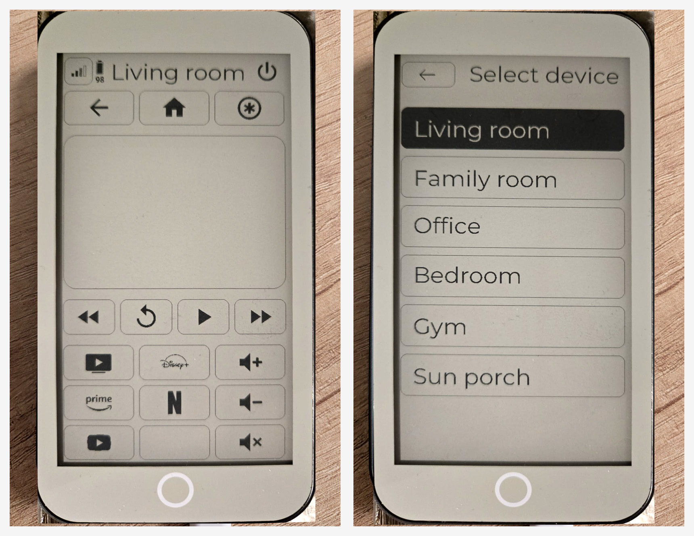

# Home Assistant ePaper media remote

e-Ink media-player remote for Home Assistant built with [FastEPD](https://github.com/bitbank2/FastEPD).



The device drives one or more `remote.*` / `media_player.*` entities in Home Assistant over the HTTPS REST API — no add-on or plugin required on the server. The on-screen layout is a single media-controller page: D-pad touchpad, transport, volume, and a 2x3 source-selection grid, with a header strip for device switching, Wi-Fi status, Power, and Battery. Light sleep, deep sleep, and a Wi-Fi fast-connect cache keep idle draw low between presses.

## Hardware supported

- [Lilygo T5 E-Paper S3 Pro](https://lilygo.cc/products/t5-e-paper-s3-pro)
- [M5Stack M5Paper S3](https://docs.m5stack.com/en/core/PaperS3)  (_untested_)

## Setup

You will need to install [PlatformIO](https://platformio.org/) to compile the project.

### Generate icons

Find the icons for your buttons at [Pictogrammers](https://pictogrammers.com/library/mdi/).
Use "Download PNG (256x256)" and place your icons in the `icons-buttons` folder.
Make sure you have an icon for the "on" state and one for the "off" state of each of your buttons.

Then run the python script `generate-icons.py` to generate the file `src/assets/icons.h`.
You will need to install the library [Pillow](https://pillow.readthedocs.io/en/stable/installation/basic-installation.html#basic-installation) to run this script.

### Get a home assistant token

In Home Assistant:

- Click on your username in the bottom left
- Go to "security"
- Click on "Create Token" in the "Long-lived access tokens" section
- Note the token generated

### Update configuration

Copy `src/config_remote.cpp.example` to `src/config_remote.cpp` then update the file accordingly. You configure:

- Wi-Fi SSID/password (plus optional static IP/gateway/subnet/DNS).
- Home Assistant base URL (`https://host:port`, no trailing slash, no path) and a long-lived access token.
- The shared `media_remote_commands` map — names sent to `remote.send_command` for each D-pad / transport key (defaults match Roku ECP / HA-canonical names like `Up`, `Down`, `Select`, `Back`, `Home`, `Play`, `reverse`, `forward`, `replay`).
- One or more `media_devices[]` entries. Each device has a title (shown in the header), a `remote.*` entity for D-pad/transport, a `media_player.*` entity for volume, a `media_player.*` entity for `select_source`, an optional `HassAction` for the Power button (any `domain.service` + entity), and up to 6 source-channel labels+icons. Tap the title in the header to switch between configured devices; the active index is persisted in NVS.

## Current UI and feature set

- Media controller home screen:
  - Header: Wi-Fi status (tap → Wi-Fi settings), device title (tap → device picker), Power button, Battery indicator (tap → battery status).
  - Touchpad D-pad: tap fires OK/Select, swipe past a 5-pixel threshold fires Up/Down/Left/Right. Tap dispatches after a 120 ms hold so the user doesn't have to lift first.
  - Transport row: Back, Home, Info, Play/Pause, Rewind, Fast-Forward, Instant-Replay.
  - Volume row: Volume Up / Down / Mute. Hold Vol± to auto-repeat every 200 ms.
  - Source grid: up to 6 per-device source channels, each calls `media_player.select_source` against the source entity.
- Device switching:
  - Per-device entity bindings (`remote`, `volume`, `source`, `power_action`) configured in `config_remote.cpp`.
  - Up to `MAX_MEDIA_DEVICES` entries; picker is the header title.
- Settings:
  - Wi-Fi settings page shows status, active profile, SSID, IP, RSSI, scan results, and a default-profile reset.
  - On-screen Wi-Fi password keyboard for secure networks.
  - Battery status page (when a BQ27220 fuel gauge / BQ25896 charger IC is fitted) shows SoC, voltage, charge state, and charger health.
- Standby and deep sleep:
  - Frontlight off after 10 s idle
  - Switches to standby mode after 60 s idle, wakes quickly on touch
  - Enters deep sleep after 30 min idle; display a sleep screen; wakes on the side BOOT button.
  - Re-association uses a cached BSSID/channel so the first HA command after wake lands quickly.
  - The BQ27220 fuel gauge is dropped into hibernate before deep sleep to cut board quiescent draw.
- Hardware buttons:
  - Boot side button (Lilygo T5 S3 Pro): returns to the media controller home / wakes from deep sleep.
  - Front home button (Lilygo T5 S3 Pro): returns to the media controller home (except for deep sleep mode)
  - IO48 side button (Lilygo T5 S3 Pro): enables/disables the frontlight, and counts as user activity for the idle timer.
- Network resilience:
  - HTTPS POSTs keep the TLS session alive across requests with explicit TCP keepalive.
  - On a transport error while Wi-Fi is healthy, the command retries every 200 ms within its 2 s lifetime before the device shows the "lost connection" screen.
  - Retry button on the HA-Disconnected screen pokes the HA task to probe immediately rather than bouncing Wi-Fi.

## Wi-Fi behavior notes

- If the startup/default Wi-Fi cannot be reached, firmware automatically opens Wi-Fi settings after a short timeout so another network can be selected.
- Wi-Fi scans run from the settings page and populate a paged network list.
- Custom Wi-Fi profile (SSID/password) is saved in NVS and can be reset to default from Wi-Fi settings.
- If upload fails with a busy serial port, close any active monitor process before flashing again.

## PlatformIO command quick reference

Run commands from the project root.

### Environments

- `lilygo-t5-s3` for Lilygo T5 E-Paper S3 Pro
- `m5-papers3` for M5Paper S3

### Common commands (Lilygo)

- Build only:

```bash
pio run -e lilygo-t5-s3
```

- Flash firmware:

```bash
pio run -e lilygo-t5-s3 -t upload
```

- Open serial monitor:

```bash
pio run -e lilygo-t5-s3 -t monitor
```

- Flash and then monitor in one command:

```bash
pio run -e lilygo-t5-s3 -t upload -t monitor
```

### Common commands (M5Paper)

- Build only:

```bash
pio run -e m5-papers3
```

- Flash firmware:

```bash
pio run -e m5-papers3 -t upload
```

- Serial monitor:

```bash
pio run -e m5-papers3 -t monitor
```

### Useful notes

- Exit monitor with `Ctrl+C`.
- If upload fails with a busy serial port, close monitor and run upload again.
- The Lilygo environment enables `esp32_exception_decoder` in monitor filters, so stack traces are decoded automatically.

## Notes

### Continuous Integration

- GitHub Actions workflow: `.github/workflows/platformio-build.yml`
- Runs on push to `main`, pull requests, and manual dispatch
- Builds both PlatformIO environments:
  - `lilygo-t5-s3`
  - `m5-papers3` (_untested_)

### Getting more logs

To get some logs from the serial port, uncomment the following line from `platformio.ini`:

```
    # -DCORE_DEBUG_LEVEL=5
```

### Updating the font

The font used is Montserrat Regular in size 26, it was converted using [fontconvert from FastEPD](https://github.com/bitbank2/FastEPD/tree/main/fontconvert):

```
./fontconvert Montserrat-Regular.ttf `src/assets/Montserrat_Regular_26.h` 26 32 126
```

## License

[This project is released under Apache License 2.0.](./LICENSE)

This repository contains resources from:

- https://github.com/Templarian/MaterialDesign (SIL OPEN FONT LICENSE Version 1.1)
- https://github.com/JulietaUla/Montserrat (Apache License 2.0)
